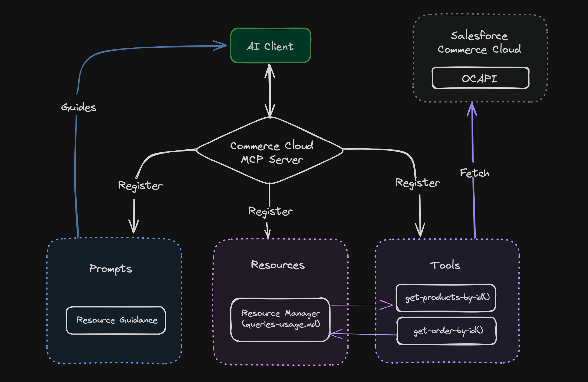

# 🛍️ Commerce Cloud MCP Server

A server that helps connect your AI applications with Salesforce Commerce Cloud. It uses the Model Context Protocol (MCP) to make data exchange between your AI client application and Commerce Cloud instance.

## ✨ Features

- 🔌 Uses OCAPI to connect to Salesforce Commerce Cloud instance
- 🛠️ Built with MCP TypeScript SDK
- ✅ Vitest for unit testing
- ⚙️ Environment-based configuration using .env file

## 🔄 Flow Diagram



## 🚀 Setup Instructions

### Prerequisites

- Node.js version 22 or higher
- Git
- A Salesforce Commerce Cloud instance with OCAPI access
- An MCP client application (like Claude Desktop App)

### Installation Steps

1. Clone the repository:

```bash
git clone https://github.com/your-username/commercecloud-mcp-server.git
cd commercecloud-mcp-server
```

2. Install dependencies:

```bash
npm install
```

3. Create and configure your environment file:

```bash
cp .env.example .env
```

Edit the `.env` file with your Salesforce Commerce Cloud credentials.

4. Build the project:

```bash
npm run build
```

5. Import OCAPI configurations:

   The OCAPI configuration files are located in the `data/ocapi` directory. Import them into your SFCC Business Manager:

   - Log into Business Manager
   - Navigate to Administration > Site Development > Open Commerce API Settings
   - For each JSON file in the `data/ocapi` directory:
     - Select the appropriate API type (Shop/Data)
     - Copy the contents of the JSON file
     - Paste into the configuration field
     - Click "Save"

   These configurations enable the necessary endpoints for the MCP server to function.

6. Configure your MCP client application (Example - Claude Desktop App):

   - Open Claude Desktop App
   - Go to File > Settings > Developer > Edit Config
   - This will open a folder containing a file `claude_desktop_config.json`
   - Open the file in an editor and add the server details:

```json
{
  "mcpServers": {
    "commercecloud": {
      "command": "node",
      "args": ["/ABSOLUTE/PATH/TO/commercecloud-mcp-server/dist/index.js"]
    }
  }
}
```

Note: Replace `/ABSOLUTE/PATH/TO/` with the actual path to your project folder.

## 📋 Use Cases

| Use Case Name         | Description                                                                        | Implementation Status    |
| --------------------- | ---------------------------------------------------------------------------------- | ------------------------ |
| Product Details       | Fetch product information from Commerce Cloud                                      | ✅ Supported Now         |
| Product Updates       | Generate product descriptions from images and update product details automatically | ✅ Supported Now         |
| Order Details         | Analyze order patterns and get insights about customer purchase behavior           | ✅ Supported Now         |
| Custom Objects        | Read, Write, and Create custom objects                                             | ✅ Supported Now         |
| Content Assets        | Fetch content assets from Commerce Cloud                                           | ✅ Supported Now         |
| Content Updates       | Generate content body from design images and update content assets automatically   | ✅ Supported Now         |
| Site Preferences      | Manage site-specific configurations and preferences                                | 🔄 Future Implementation |
| Promotions & Campaign | Manage promotions and campaigns                                                    | 🔄 Future Implementation |
| Job Configurations    | Manage job configurations                                                          | 🔄 Future Implementation |

## 📚 Supporting Documentation

- [Model Context Protocol (MCP)](https://modelcontextprotocol.io/introduction)
- [Typescript SDK](https://github.com/modelcontextprotocol/typescript-sdk)
- [Open Commerce API](https://developer.salesforce.com/docs/commerce/b2c-commerce/references/b2c-commerce-ocapi/get-started-with-ocapi.html)

## 📄 License

This project is licensed under the MIT License - see the [LICENSE](LICENSE) file for details.

## 👥 Credits

Greater minds than mine are behind creating tools that made this project possible. I would like to mention those projects

- [colinhacks](https://github.com/colinhacks) for ([zod](https://zod.dev/)).
- [antfu](https://github.com/antfu) for ([vitest](https://vitest.dev/)).
- [Egoist](https://www.github.com/egoist) for ([tsup](https://www.github.com/egoist/tsup))

I hope you find this tool useful! 🌟

Made with ❤️ by [Brinsil](https://www.github.com/BrinsilElias).
